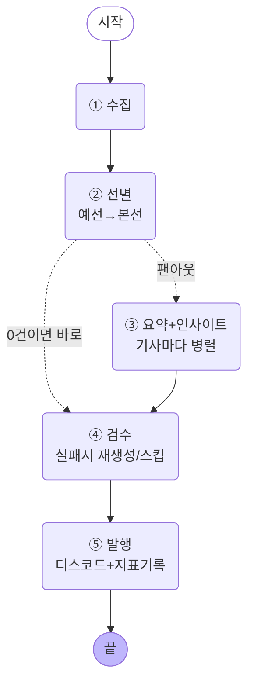
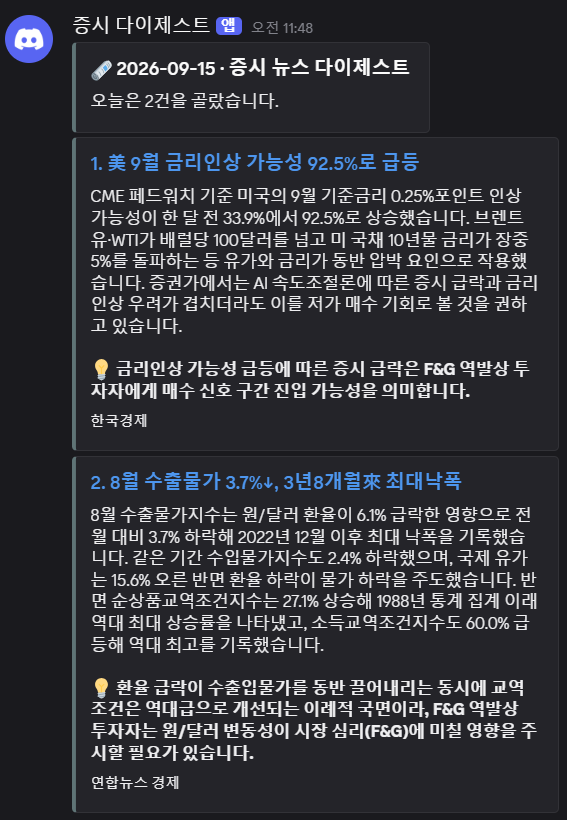

# 나만의 뉴스레터 에이전트 — 증시 뉴스 다이제스트

## 1. 분야 및 독자 정의

**분야**: 증시(투자) 뉴스 — 실제로 매일 F&G(공포·탐욕) 지수 기반 역발상 투자를 하고
있는 개인 투자자 관점에서, 국내외 증시에 영향을 주는 소식을 매일 아침 자동으로
받아보는 시스템을 만들었다.

**독자 페르소나**:
- 누구: F&G 지수 기반으로 역발상 투자를 하는 개인 투자자 — 나스닥/TQQQ 비중이 큼
- 이미 아는 것: 주식 기본 용어, 코스피·나스닥·S&P500 지수 개념, 금리·물가가 증시에 미치는 영향
- 원하는 것: "오늘 매매 판단에 영향을 줄 만한 소식"만 골라서, 숫자(등락률·수치)가
  정확하게 들어간 요약

(전체 정의는 `audience.yaml` 참고)

## 2. 소스 채택표

소스 후보 7곳을 실제로 재봤다(측정 방법: RSS를 실제로 호출해서 HTTP 상태·건수·
최근성을 확인하고, 접속되는 곳은 최신 기사 1건의 본문을 trafilatura로 뽑아
길이를 잰다).

| 소스 | G3(접근) | 24h 이내 건수 | G1(본문 600자 이상) | 채택 여부 |
|---|---|---|---|---|
| 한국경제 (feed/finance) | 200 OK | 50건 | 통과(1,378자) | ✅ 채택 |
| 연합뉴스 경제 | 200 OK | 120건 | 통과(1,069자) | ✅ 채택 |
| Investing.com (news_25) | 200 OK | 10건 | 통과(3,264자) | ✅ 채택 |
| Yahoo Finance | 200 OK | 50건 중 11건 | 통과(5,400자) | ✅ 채택 |
| CNBC Markets | 200 OK | 30건 중 1건 | 통과(7,264자) | ✅ 채택 (아래 참고) |
| **매일경제** (mk.co.kr/rss) | **403 Forbidden** | 측정 불가 | 측정 불가 | ❌ **탈락** — G3(접근) 관문 자체를 통과 못함(요청이 아예 차단됨). 판단이 아니라 서버가 준 상태 코드 그대로다 |
| **서울경제** (sedaily.com/RSS) | **404 Not Found** | 측정 불가 | 측정 불가 | ❌ **탈락** — 주소 자체가 존재하지 않음(RSS 개편/폐지로 추정) |

매일경제·서울경제는 접근(G3) 단계에서 바로 걸러졌다 — 이건 임의 판단이 아니라
서버가 돌려준 HTTP 상태 코드(403/404) 그 자체가 근거다. 반면 CNBC는 접근·본문은
전부 통과했는데 "24시간 내 신규글 1건"이라는 생존(G2) 수치를 놓고 판단이
갈렸던 사례다 — 그 판단 과정은 아래에 따로 적는다.

**CNBC를 뺐다가 다시 넣은 이유(중요한 시행착오)**: 처음엔 "24시간 내 신규글이
1건뿐"이라는 이유로 이 소스를 뺐다. 그런데 이 컷오프("1건 미만이면 탈락")가
사실 근거 없이 내가 임의로 정한 숫자였다는 지적을 받았다 — G1(본문)은 이미
통과했는데, G2(생존)를 "몇 건 이상이어야 하는가"에 대한 규칙을 스스로 정의하지
않은 채 감으로 잘랐던 것이다.

그래서 방침을 바꿨다: **G1만 통과하면 소스 단계에서 미리 막지 않고, 선별
단계(예선·본선)의 자연스러운 경쟁에 맡긴다.** 실제로 CNBC를 다시 넣고 돌려보니
수집량은 194건(안 넣었을 때 191건, +3건)으로 거의 안 늘었고, 최종 선택 5건 중
CNBC 기사는 0건이었다 — 낮은 기여도가 문제라면 그건 선별 단계가 알아서
걸러주지, 소스 단계에서 억지로 판단할 이유가 없다는 게 실험으로 확인됐다.
(이 판단 번복 과정 자체를 회고 6번에도 남겼다.)

## 3. 선별 로직 설계

**중요도 판단 문장** (`audience.yaml`의 `중요도_기준`, 예/아니오로 답할 수 있게 작성):
- 미국 연준(Fed)의 금리 결정이나 통화정책 방향이 새로 나왔거나 바뀌었나
- 코스피·나스닥·S&P500 등 주요 지수가 하루 만에 1% 이상 크게 움직였나
- 국제 유가·환율·국채금리처럼 시장 전반에 영향을 주는 거시 변수가 크게 변했나
- 지금 쓰는 매매 전략(F&G 기반 역발상 매매)의 판단 기준에 영향을 줄 만한 소식인가

**예선/본선 2단계 구조**: 하루 수집량이 190건대(연합뉴스 혼자 120건대)라 한
화면에 다 놓고 비교할 수 없다. 그래서 30건씩 묶어(하루 수집량 ÷ 30 ≈ 7묶음)
묶음마다 5건씩 예선 통과시키고, 통과분(약 35건) 전체를 본선에서 상대평가로
비교해 최종 5건을 고른다. 이때 각 선택에 `event`(사건 라벨)를 붙이게 해서
같은 사건 중복을 프롬프트로 부탁한다.

**코드로 한 번 더 거르기**: 프롬프트로 "같은 사건은 하나만"이라고 부탁해도
확률적으로만 지켜진다(어제 실습에서 실제로 확인한 문제). 그래서 본선 결과에
event 라벨 중복 제거 + 매체(source)당 최대 2건 상한을 코드로 강제했다
(`graph.py`의 `_dedup_and_cap`). 이전 실행에서는 이 필터가 실제로 1건을
걸러낸 적도 있고(아래 5번 "1차 실행" 로그), 이번 최종 실행에서는 0건이 걸러졌다
— 필터가 "있어도 매번 작동해야 하는 건 아니고, 필요할 때만 작동하면 된다"는
것도 함께 확인했다.

## 4. 파이프라인 구조도



State(`NewsletterState`): `hours`(설정) · `collected`/`picked`(단계 결과, 덮어쓰기) ·
`drafted`(팬아웃 워커들이 각자 채움, `operator.add` 리듀서) · `verified`(검수 통과분) ·
`log`(모든 노드가 한 줄씩 남김, `operator.add` 리듀서).

## 5. 실행 기록

**최종 검수를 거쳐 실제로 디스코드에 발행된 화면**:



위 캡처는 2차 실행(24시간 창, 4소스) 결과다 — 검수(④)를 통과한 2건이 실제로
"뉴스레터-에이전트" 디스코드 채널에 그대로 올라간 것을 볼 수 있다. 각 카드의
💡 표시가 insight(인사이트) 필드이고, 맨 아래 출처는 `source` 필드다.

**1차 실행(6시간 창, dry-run, 4소스)** — 검수 실패 → 재생성 → 합격 경로를 처음 확인:
```
① 수집   6시간 창 · 141건 (소스 4곳, 무응답/0건: ['Yahoo Finance'])
② 선별   141건 → 묶음 5개 → 예선 25건 → 본선 5건 → 중복/상한 제거 1건 → 최종 4건
   매체상한 제외: 코스피 급락에도 은행주는 상승한 네 가지 이유
   취재 실패(파싱 오류 JSON을 찾을 수 없음: ...): 美 3년 만에 금리 인상 나서나…
   취재 완료: 美 국채 5% 돌파, 뉴욕증시 급락 / 8월 수출물가 3.7% 급락 / 사우디 송유관 피격, 유가 급등
④ 검수 불합격(본문에 없는 숫자: {'500,'}), 재생성 시도: 금리·유가 상승에 'AI 속도조절론'까지…
   재생성 후 합격: 국채금리 5% 돌파, 뉴욕증시 급락
⑤ 발행   3건 · dry-run (실제 발송 안 함)
```

**2차 실행(24시간 창, 실제 발행, 4소스)**: 191건 수집 → 최종 2건 실제 발행 성공.

**3차 실행(24시간 창, 실제 발행, CNBC 포함 5소스 — 최종 제출 버전)**:
```
① 수집   24시간 창 · 194건 (소스 5곳, 무응답/0건: 없음)
② 선별   194건 → 묶음 7개 → 예선 35건 → 본선 5건 → 중복/상한 제거 0건 → 최종 5건
   취재 완료: 美 9월 금리인상 확률 92.5%로 급등 / 국고채 금리 대체로 상승세 / 사우디 송유관 폐쇄, 경유값 최고치 / 연준, 25일 금리인상 초읽기
   취재 실패(본문 부족): [포토] 코스피 6700선 붕괴…3.26% 하락
④ 검수 합격: 美 9월 금리인상 확률 92.5%로 급등 / 국고채 금리 대체로 상승세 / 사우디 송유관 폐쇄, 경유값 최고치
④ 검수 불합격(본문에 없는 숫자: {'7', '0.25%'}), 재생성 시도: Counting the votes: Warsh face...
   재생성 후에도 불합격(본문에 없는 숫자: {'7', '0.25%'}) — 이 건은 스킵
⑤ 발행   3건 · 성공
```
디스코드 채널("뉴스레터-에이전트")에 실제로 발행됐고, `store/metrics.jsonl`에
세 번의 실행 기록이 모두 남아있다.

## 6. 프로젝트 회고

**가장 공들인 부분**: 검수(④)와 예외 처리다. 처음엔 "숫자가 본문에 있는지"만
문자열로 대조했는데, 실제로 돌려보니 "5%"라는 표현이 원문과 요약에서 다르게
적히거나 쉼표 하나가 숫자로 오인식되는 등 오탐이 나왔다. 그래도 실패하면 바로
버리지 않고 **한 번 재생성**하게 만들어서, 실제로 재생성 후 합격하는 케이스와
재생성해도 끝내 실패해 스킵되는 케이스를 둘 다 로그로 직접 확인했다.

**실제로 겪은 두 번의 실수와 고친 과정** (이게 이번 프로젝트에서 제일 배운 것):

1. **소스 탈락 기준을 감으로 정했다가 정정한 것**. "24시간 내 1건뿐이라 죽은
   소스"라는 판단은 엄밀한 기준이 아니라 임의의 컷오프였다. 지적을 받고
   나서야, "G1만 통과하면 소스 단계에서 미리 판단하지 말고 선별 경쟁에 맡긴다"
   는 더 원칙 있는 방침으로 바꿨고, 실험으로 그 방침이 결과를 해치지 않는다는
   것도 확인했다. 기준을 세울 땐 "왜 이 숫자인가"를 스스로 설명할 수 있어야
   한다는 걸 체감했다.
2. **max_turns=1로 실제 파이프라인이 죽은 것**. 본선(상대평가) 단계에서 Claude
   호출이 "Reached maximum number of turns (1)" 오류로 실패하면서 전체
   실행이 그대로 죽었다 — `ask_claude` 안에 예외처리가 없었기 때문이다.
   ①수집 노드는 "소스 하나가 죽어도 나머지는 모은다"는 원칙을 처음부터
   지켰으면서, 정작 AI 호출 자체가 실패하는 경우는 놓치고 있었다. `ask_claude`
   에 try/except를 추가해 실패해도 빈 문자열을 돌려주게 하고, 그 실패가
   기존의 "JSON 파싱 실패 시 안전한 대체값" 경로로 자연스럽게 흡수되도록
   고쳤다. 예외 처리는 "어디서 실패할지 예상되는 곳"뿐 아니라 "외부 API 호출
   전체"에 기본으로 깔려 있어야 한다는 걸 실제 크래시로 배웠다.

**향후 개선하고 싶은 점**:
1. 검수를 문자열 대조 대신 "숫자만 따로 뽑아 원문과 다시 물어보는" 방식으로
   바꾸면 쉼표·단위 표기 차이로 인한 오탐을 줄일 수 있을 것 같다.
2. Yahoo Finance처럼 24시간 내 갱신이 적은 소스는 시간 창을 넓히거나(예: 48시간)
   별도 취급이 필요해 보인다.
3. 예선/본선 파싱 실패 시의 "안전한 대체값"이 지금은 앞에서부터 그냥 채우는
   방식인데, 실패 자체를 metrics.jsonl에 별도로 남기면 나중에 "AI 호출이 얼마나
   자주 실패하는지"를 추적할 수 있을 것 같다.
